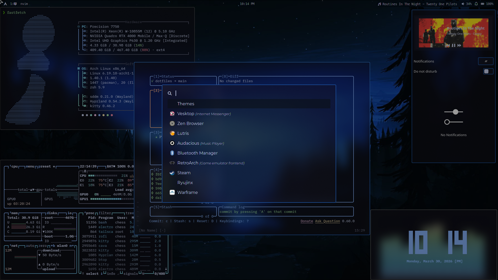
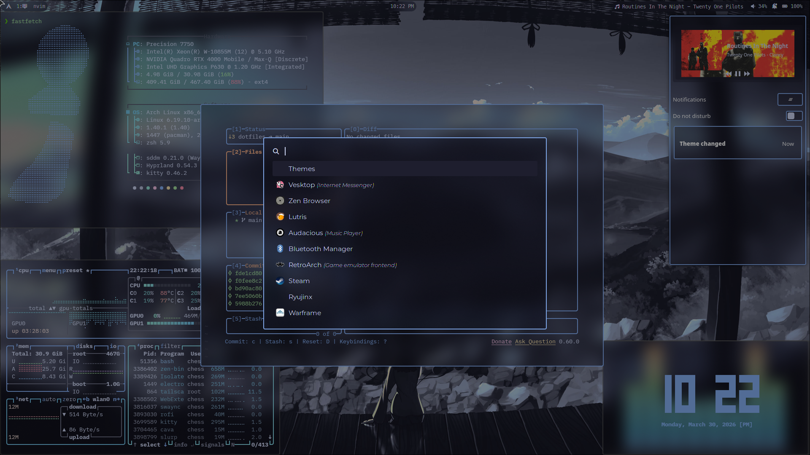

<h1 align="center">My hyprland config</h1>

## Requirements
- btop      - System Monitor
- cava      - Audio Visualizer
- fastfetch - System Information
- hyprland  - Window Manager
- awww      - Wallpaper Manager
- hyprlock  - Lock Screen
- hypridle  - Locks Screen When Idle
- kitty     - Terminal
- nvim      - IDE
- rofi      - Application Laucher & Other Menus
- swaync    - Notification Daemon
- waybar    - Status Bar
- wlogout   - Logout Menu (looking to swap with nwg-bar)
